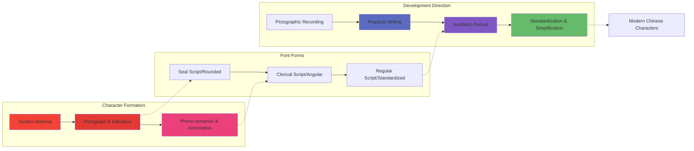

import useBaseUrl from '@docusaurus/useBaseUrl';
import 'katex/dist/katex.min.css';
import { InlineMath, BlockMath } from 'react-katex';
import Link from '@docusaurus/Link';

**TLDR**
This article provides a systematic introduction to the core concepts, methodologies, historical evolution, and emerging trends in data visualization. It begins by elucidating the essence of visualization—optimizing information transmission through visual encoding while leveraging the human eye's high-bandwidth parallel processing capabilities to achieve rapid data comprehension. The article then traces the evolution of visualization from the 17th century to present day, along with a microcosm of China's charting library development from ECharts to AntV to VCharts. At the application level, it delineates three major domains: scientific visualization (simulation), information visualization (communication), and visual analytics (analysis), with particular focus on frontier topics including narrative visualization, AI4VIS, VIS4AI, and immersive visualization. Finally, it points out that by empowering the design pipeline with AI and introducing well-designed narrative interactions, the industry can effectively address the dual challenges of designer scarcity and high cognitive barriers for users.

{/* truncate */}

## Introduction

### Definition

What is data visualization?

Using visual encoding as a means to achieve the goal of optimizing information transmission—that is visualization.

### Architecture

The human eye is a high-bandwidth, massive visual signal input parallel processor with a maximum bandwidth of 100MB per second. It possesses strong pattern recognition capabilities, perceiving visual symbols orders of magnitude faster than numbers or text, with much of the visual information processing occurring at the subconscious level.

Information achieves rapid
transmission through encoding
—such as idioms, proverbs, and internet slang. The essence of this encoding lies
in leveraging the 
  cognitive commonality
 within the same (cultural) group to create implicit context. Encoded information
becomes a readable compressed package (
  readability enables propagation, which further enriches context
), decompressed within each receiving individual by combining with their internal
context.

Among all human senses, vision has the largest bandwidth. To avoid information overload, the brain has even developed filtering protection mechanisms. For example, in a meeting with all participants, you first become aware of the number of individuals, then clothing styles (colors), followed by gender inferred from clothing, and finally facial features and other details. This information is captured by the eyes in an instant, but forming an information stream requires further brain processing, including recognition, memory, and association.

Combining the aforementioned 【Information Encoding】 and 【Visual Perception Advantage】, the concept of visualization emerged. From childhood, we naturally accept all available visual encoding methods—from using red markers to highlight key points in textbooks, to colorful UI interfaces, and now to AR/VR immersive perception—visualization is omnipresent.

"Visualization is as old as the hills." Despite visualization existing everywhere in our lives, it has been difficult to form a unified systematic cognitive framework due to characteristics such as multimodality, cultural differences, and perceptual variations (such as the red and green of stock markets). However, visualization performs exceptionally well in data-related fields. In elementary and middle school mathematics, students are guided to think at the visualization level through the concept of 【combining numbers with shapes】. Visualization flourished in statistics (Anscombe's Quartet, Iris dataset), plays a crucial role in data analysis, and is now gradually participating in the tuning process of AI models and robots (foxglove).

Due to visualization's outstanding performance in the data domain, data visualization has become a more widely recognized term.

:::info
Combining numbers with shapes: 

Anscombe's Quartet: 

Iris dataset: 
:::

Just as humans contracted HIV from gorillas, underlying methodologies and tools often apply equally well to higher-level tools. Information transmission is a compound and fundamental discipline, leading to visualization being widely applied across various fields.

### Methodology

Case Study:

<iframe
  id="train-schedule-demo"
  src={useBaseUrl('/demo/datavizReview/train-schedule.html')}
  width="100%"
  style={{ border: 'none' }}
  onLoad={(e) => {
    // Adjust iframe height to match content
    const iframe = e.target;
    iframe.style.height =
      iframe.contentWindow.document.documentElement.scrollHeight + 'px';
  }}
/>

:::tip
Chart Description:

Y-axis represents multiple locations along the train route, with distances between locations proportional to the track length between them, i.e., inter-station track distance.

X-axis represents time scale within a single cycle, with minimum granularity to the minute.
:::

The above chart can be interpreted from multiple perspectives:

1. With X-axis as the primary encoding, you can see train frequency within the time range
2. With Y-axis as the primary encoding, you can see the time distribution of trains at a single location
3. From a single train's perspective, you can see information such as the number of stops, duration, vehicle speed, and direction of travel
4. From multiple trains' perspective, you can see more composite information, such as: transfers, station traffic, peak passenger periods, track wear rate, etc.

There are two gaps in the propagation and application of visualization:

- Q1. The industry lacks excellent visualization designers
- Q2. High cognitive barriers for users

#### Grammar of Graphics

Please refer to the previous article <Link to="/blog/the-grammar-of-graphic">《Grammar of Graphics》</Link>

:::info

:::

Semantically friendly, perfect for combining with LLM.

#### Gestalt Principles

:::info

:::

#### ONQ Visual Mapping Priority

#### Data-Driven Design

### Evolution

#### Before 17th Century: The Birth of Charts

Human map from 6200 BC

#### 1600—1699: Physical Measurement

Sunspots

#### 1700—1799: Graphical Symbols

Isogonic lines & Color Pyramid

#### 1800—1900: Data Graphics

First flow diagram showing passenger flow direction and volume

#### 1900—1949: Modern Enlightenment

Standardized subway route visualization method

#### 1950—1974: Visual Encoding of Multidimensional Information

Graphical symbols & Representation theory

#### 1975—1987: Multidimensional Statistical Graphics

Enhanced scatter plot expression & Scatter plot matrix

#### 1987—2004: Interactive Visualization

Table Lens

#### 2004—Present: Visual Analytics

:::info
A microcosm of visualization development through the evolution of Chinese frontend charting libraries:

1. ECharts

   
   ECharts focuses more on functionality but lacks abstraction, similar to a business
   component library. It has high expansion difficulty, and new charts cannot be
   quickly adapted to all features at low cost.

2. AntV

   
   AntV is designed based on the "Grammar of Graphics," providing more abstract API
   design and more reasonable functional layering, but also raises the entry barrier
   for ordinary frontend developers, requiring users to have some grasp of visualization
   design and terminology. Refines visualization classification and produces multiple
   types of visualization component libraries.

   AntV examples based on Grammar of Graphics:

   

     
     
     
     
   

3. VCharts

   
   Combines the advantages of both ECharts and AntV, providing more abstract API
   design and more reasonable functional layering, with built-in multiple best practices.
   Uses unified syntax layer covering both 2D and 3D, focusing on narrative visualization
   expression.

   Some quality interactions in VCharts:

   

     
     
   

:::

:::tip
As a primitive visual information transmission method for humans, the development history of visualization can almost echo the development history of Chinese characters.

Chinese characters have gone through the following development stages:

Symbol marking, continuously adding graphic details, to pictograph and indicative

Pictograph and indicative, unable to describe abstract concepts, forming phono-semantic and associative through lexical and grammatical rules

Beyond phono-semantic and associative:

- 1.【Cost Reduction】Reducing writing costs by simplifying character structure
- 2.【Standardization】Forming standard writing systems through standardization
- 3.【Aesthetic Pursuit】Further exploring and amplifying the visual expression capability of characters through aesthetic pursuit

:::

## Current Status & Frontiers

### Application Domains

#### Scientific Visualization

【Simulation】Medical imaging, meteorology, astronomy, fluid dynamics, materials science, physics, energy sector, digital twins

#### Information Visualization

【Communication】Business intelligence, social networks, finance, data journalism, human resources, internet industry

1 Data, 100 Viz

metaball:

group by different visual:

winglets:

sticky graph:

#### Visual Analytics

【Analysis】Intelligence analysis, spatiotemporal data exploration, large-scale data exploration, virus propagation, money laundering & anti-money laundering, media analysis

User behavior analysis:

### Hot Applications & Frontier Research

#### StoryTelling & Narrative Visualization

Chart design:

Dashboard design:

Narrative Visualization:

#### AI4VIS

https://ai4vis.github.io/

#### VIS4AI

https://foxglove.dev/

#### Immersive Visualization

<video width="100%" height="auto" controls>
  <source src={useBaseUrl('/video/Vision Pro Viz.mp4')} type="video/mp4" />
  Your browser does not support the video tag.
</video>

## Conclusion

- Q1. The industry lacks excellent visualization designers
- A1. Through systematic design theory and best practices, empower the design pipeline with AI to improve visualization design efficiency and quality

- Q2. High cognitive barriers for users
- A2. Narrative visualization, introducing appropriate interactions and animations to reduce user comprehension costs
