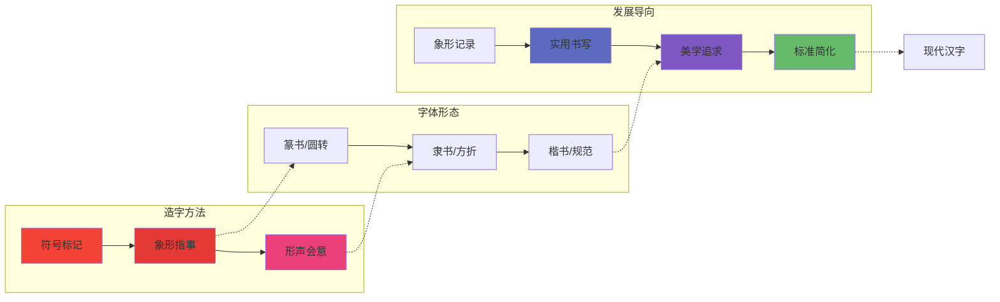

import useBaseUrl from '@docusaurus/useBaseUrl';
import 'katex/dist/katex.min.css';
import { InlineMath, BlockMath } from 'react-katex';
import Link from '@docusaurus/Link';

**TLDR**
本文系统性地介绍了数据可视化的核心概念、方法论、发展历程与前沿趋势。文章首先阐释了可视化的本质——通过视觉编码优化信息传递，结合人眼的高带宽并行处理能力，达到快速理解数据的目的。接着梳理了从 17 世纪至今的可视化演进脉络，及国内图表库从 ECharts 到 AntV 再到 VCharts 的发展缩影。在应用层面，文章划分了科学可视化（模拟）、信息可视化（传达）、可视分析（分析）三大方向，并重点探讨了可视化叙事、AI4VIS、VIS4AI、沉浸式可视化等前沿热点。最后指出，通过 AI 赋能设计链路和引入合理的叙事交互，可以有效解决业内设计师匮乏和用户认知门槛高的双重挑战。

{/* truncate */}

## 简介

### 定义

数据可视化是什么？

通过视觉编码的手段，达到优化信息传递的目的，就是可视化。

### 架构

人眼是一个高带宽的巨量视觉信号输入并行处理器，最高带宽每秒 100MB，具有很强的模式识别能力，对可视符号的感知速度比对数字或文本快多个数量级，且大量的视觉信息的处理发生在潜意识阶段。

信息通过
编码
的方式，达到快速传递的目的，比如成语、歇后语、互联网黑话，这些编码的本质，是利用了同一(文化)群体的
认知共性
，达到隐性上下文的效果，编码后的信息是具有可读性(
可读才能传播，传播才能继续丰富上下文
)的压缩包，在每个接受个体中，结合个体内部的上下文进行解压。

人体的所有感官中，视觉是带宽最大的，为了避免信息过载，甚至激发了大脑的过滤保护装置，比如会议中的所有参会人，你首先会意识到个体的个数，然后意识到衣着风格(颜色)，接下来是从衣着风格到性别，最后是面部特征等其他细节。这些信息是在一瞬间被眼球捕获的，但想要形成信息流，还需要经过大脑的进一步处理，比如识别、记忆、联想等。

结合上述的【信息编码】和【视觉感知优势】，产生了可视化这一概念。从小我们就自然而然的接受所有可用的视觉编码方式，从小时候的红色记号笔圈出课本重点，到后来的彩色 UI 界面，甚至到现在的 AR、VR 沉浸式感知，可视化无处不在。

"可视化像山岳一样古老"，尽管可视化存在我们的生活各处，由于其多模态、文化差异、感知差异等特点，一直以来都难以形成大一统的系统性认知框架(比如股票的红色和绿色)。但是可视化在数据相关领域都表现的尤其出色，在中小学数学中，就通过【数形结合】的思想引导学生进行可视化层面的思考。可视化在统计学中兴起(四重奏、鸢尾花)，在数据分析中起到关键作用，现在逐步参与到 AI 模型和机器人的调参过程中(foxglove)。

由于可视化在数据领域的突出表现，数据可视化成为了一个更加被广泛认知的名词。

:::info
数形结合：

四重奏：

鸢尾花：
:::

如同人类从大猩猩处感染 HIV 一样，底层的方法论和工具，往往也对上层工具同样适用。信息传递是一门复合且基础的学科，导致可视化被广泛应用在各个领域。

### 方法论

案例说明：

<iframe
  id="train-schedule-demo"
  src={useBaseUrl('/demo/datavizReview/train-schedule.html')}
  width="100%"
  style={{ border: 'none' }}
  onLoad={(e) => {
    // Adjust iframe height to match content
    const iframe = e.target;
    iframe.style.height =
      iframe.contentWindow.document.documentElement.scrollHeight + 'px';
  }}
/>

:::tip
图表说明：

Y 轴，表示车次途径的多个地点，地点之间的距离与俩地之间的轨道长度成正比，即俩地轨道距离

X 轴，表示单周期内的时间刻度，最小到分钟单位
:::

可以使用多个视角解读上面的图表：

1. 以 X 轴为主编码，可以看到时间范围内的车次频率
2. 以 Y 轴为主编码，可以看到单一地点内的车次时间分布
3. 以单条车次看，可以看到停靠站点数量、时长、车辆行驶速度、车辆行驶方向等信息
4. 从多条车次看，可以看到更多复合信息，比如：换乘、站内流量、客流高峰期等、轨道磨损速度等

可视化的传播和应用存在俩个鸿沟：

- Q1. 业内缺少优秀的可视化设计师
- Q2. 对用户有高门槛的认知要求

#### 图形语法学

此处请参考之前的<Link to="/blog/the-grammar-of-graphic">《图形语法学》</Link>一文

:::info

:::

语义化友好，非常适合结合 LLM 一起食用。

#### 格式塔法则

:::info

:::

#### ONQ 视觉映射优先级

#### Data-Driven Design

### 发展

#### 17 世纪之前：图表萌芽

公元前 6200 年的人类地图

#### 1600—1699 年：物理测量

太阳黑子

#### 1700—1799 年：图形符号

等磁线&颜色金字塔

#### 1800—1900 年：数据图形

第一幅流图，展示乘客流向和流量

#### 1900—1949 年：现代启蒙

地铁路线标准可视化方法

#### 1950—1974 年：多维信息的可视编码

图形符号&表示理论

#### 1975—1987 年：多维统计图形

增强散点图表达&散点图矩阵

#### 1987—2004 年：交互可视化

表格透镜

#### 2004 年至今：可视分析学

:::info
从国内前端图表库的变迁来看可视化的发展缩影：

1. ECharts
   
   ECharts 更加聚焦功能，但缺乏抽象，类似业务组件库，扩展难度大，新增图表无法低成本快速适配所有功能。

2. AntV
   
   AntV 基于《图形语法学》设计，提供了更加抽象的 API 设计，以及更加合理的功能分层，但是也提高了普通前端的接入门槛，需要使用者对可视化设计和可视化术语有一定的掌握能力。细化可视化分类，产出多类型的可视化组件库。

3. VCharts
   
   同时结合 ECharts 和 AntV 的优点，提供更加抽象的 API 设计，以及更加合理的功能分层，内置多种最佳实践，以统一的语法层涵盖 2D 和 3D，注重可视化叙事表达。

:::

:::tip
同样作为人类的原始视觉信息传递手段，可视化的发展史几乎可以与汉字的发展史交相呼应。

汉字经过了以下发展节点：

符号标记，不断添加图形细节，到象形指事

象形指事，无法形容抽象概念，通过词法语法，形成形声会意

形声会意之上：

- 1.【成本缩减】通过简化字体结构，缩小书写成本
- 2.【标准化建设】通过标准化体系建设，形成标准的书写体系
- 3.【美学追求】通过美学追求，进一步探索并放大字体的视觉表达能力

:::

## 现状&前沿

### 应用方向

#### 科学可视化

【模拟】医学影像、气象、天文学、流体力学、材料科学、物理学、能源领域、数字孪生

#### 信息可视化

【传达】商业智能、社交关系、金融领域、数据新闻、人力资源、互联网行业

1 Data, 100 Viz

winglets:

sticky graph:

#### 可视分析

【分析】情报分析、时空数据探索、大规模数据探索、病毒传播、洗钱与反洗钱、媒体分析

用户行为分析:

### 热点应用&前沿研究

#### StoryTelling&Narrative Visualization

图表设计：

报表设计：

Narrative Visualization:

#### AI4VIS

https://ai4vis.github.io/

#### VIS4AI

https://foxglove.dev/

#### 沉浸式可视化

<video width="100%" height="auto" controls>
  <source src={useBaseUrl('/video/Vision Pro Viz.mp4')} type="video/mp4" />
  Your browser does not support the video tag.
</video>

## 总结

- Q1. 业内缺少优秀的可视化设计师
- A1. 通过系统性的设计理论和最佳实践，AI 赋能设计链路，提高可视化设计效率和质量

- Q2. 对用户有高门槛的认知要求
- A2. 可视化叙事，引入合理交互和动画，降低用户理解成本
